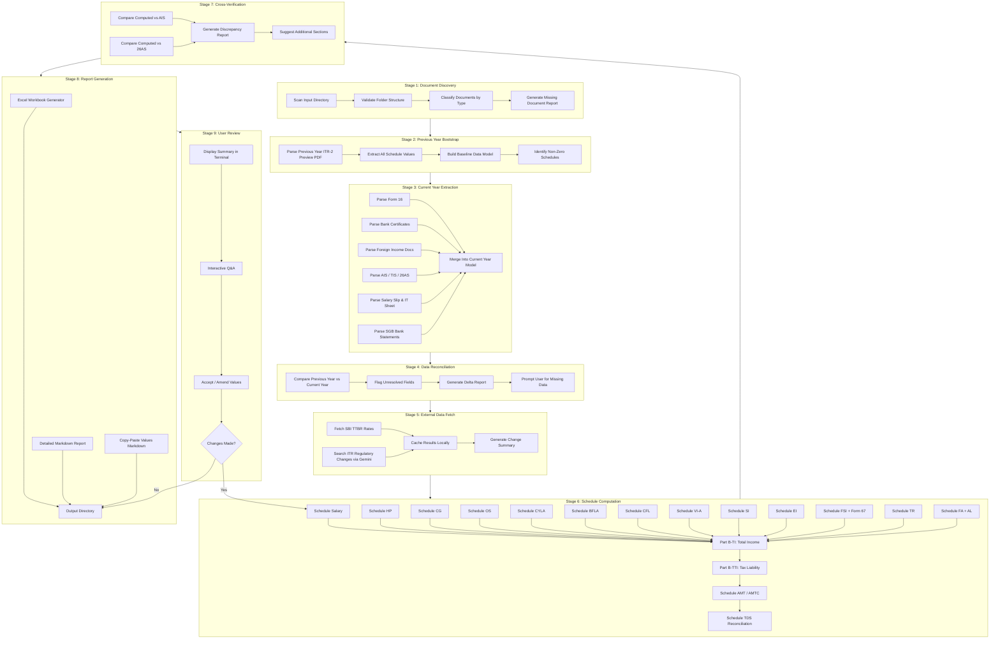
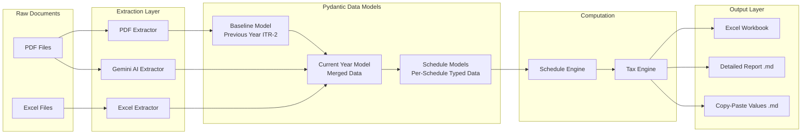
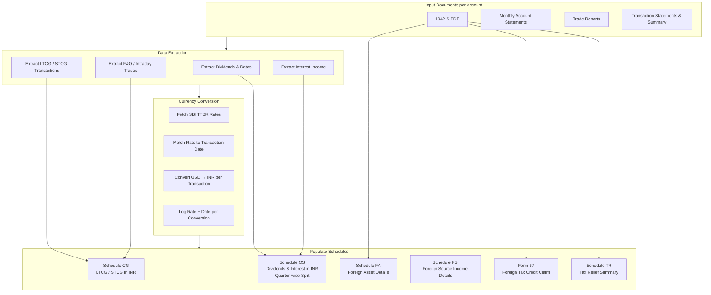
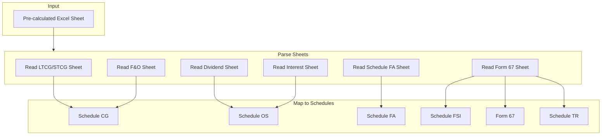
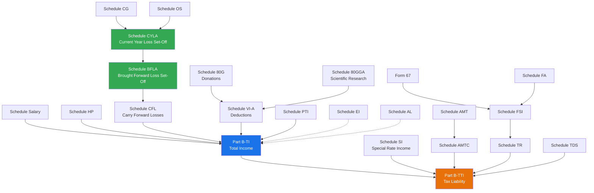
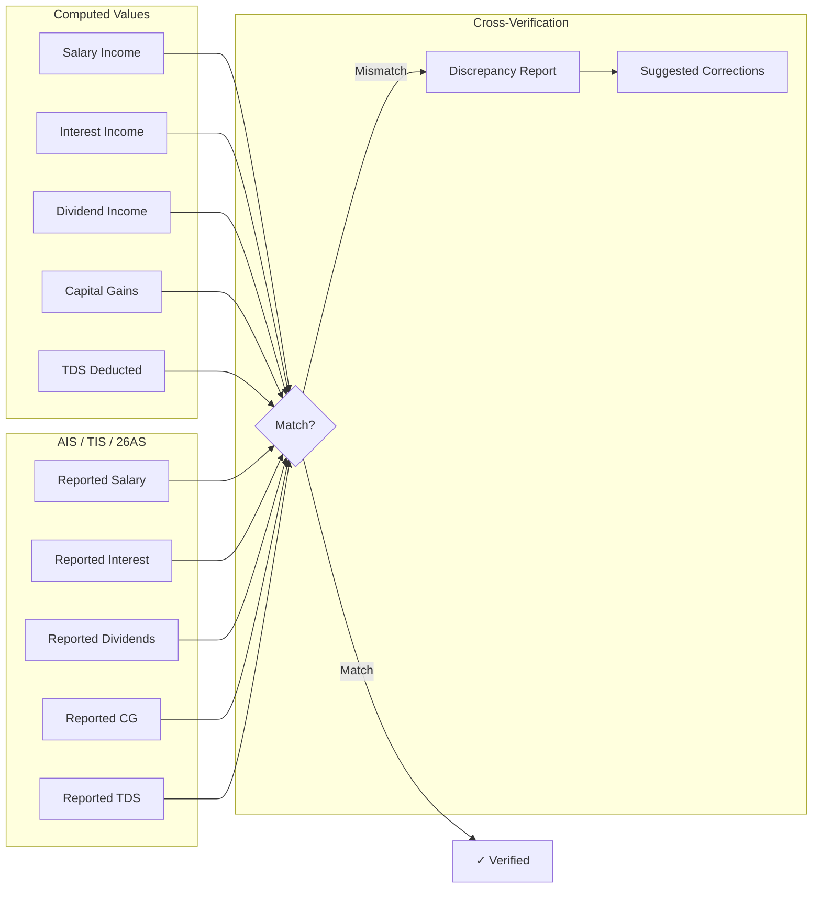

# Data Flow Architecture — Indian Income Tax Calculator

> ⚠️ **DISCLAIMER**: This tool generates AI-assisted tax calculations and is prone to errors.
> All calculations, values, and details MUST be independently verified by the user before filing.

---

## 1. End-to-End Pipeline Flow



---

## 2. Data Model Flow



---

## 3. Foreign Income Processing Flow (Option 1: Self-Calculation)

This is one of the most complex flows as it involves currency conversion, multiple income types, and multiple schedules.



---

## 4. Foreign Income Processing Flow (Option 2: Pre-Calculated Excel)



---

## 5. Schedule Dependency Graph

Schedules must be computed in a specific order due to interdependencies:



**Legend**:
- **Solid arrows** (`→`): Direct computational dependency
- **Dashed arrows** (`⇢`): Informational dependency (referenced but doesn't feed into computation)

---

## 6. Cross-Verification Data Flow



---

## 7. State Management

The pipeline maintains a central `ITRState` object that flows through all stages:

```python
@dataclass
class ITRState:
    # Configuration
    financial_year: str
    assessment_year: str
    
    # Stage 1 outputs
    discovered_documents: dict[DocumentType, list[Path]]
    missing_documents: list[str]
    
    # Stage 2 outputs
    previous_year_data: dict[ScheduleType, ScheduleData]
    non_zero_schedules: list[ScheduleType]
    
    # Stage 3 outputs
    current_year_data: dict[ScheduleType, ScheduleData]
    
    # Stage 4 outputs
    delta_report: DeltaReport
    unresolved_fields: list[UnresolvedField]
    
    # Stage 5 outputs
    ttbr_rates: dict[date, Decimal]
    itr_changes_summary: str
    
    # Stage 6 outputs
    computed_schedules: dict[ScheduleType, ComputedSchedule]
    total_income: Decimal
    tax_liability: TaxLiability
    
    # Stage 7 outputs
    verification_results: VerificationReport
    
    # Stage 8 outputs
    output_paths: OutputPaths
```

---

*Next: See [03_folder_structure.md](./03_folder_structure.md) for input/output folder conventions.*
