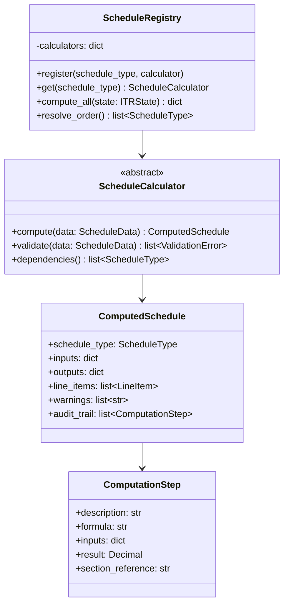
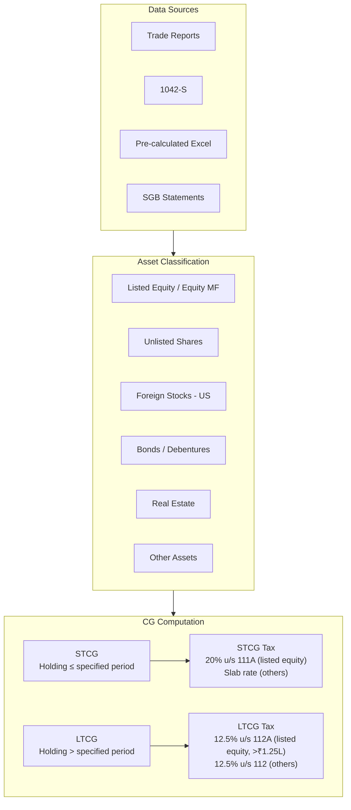
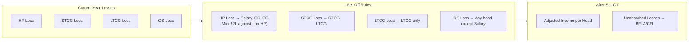
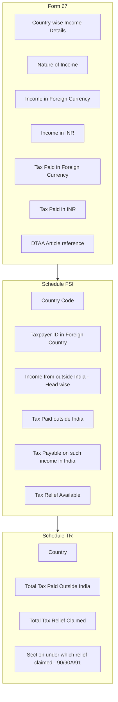

# Schedule Computation Engine — Indian Income Tax Calculator

> ⚠️ **DISCLAIMER**: This tool generates AI-assisted tax calculations and is prone to errors.
> All calculations, values, and details MUST be independently verified by the user before filing.

---

## 1. Engine Architecture



### Design Principles

1. **Registry Pattern**: All schedule calculators are registered in a central registry. The registry resolves computation order via topological sort of the dependency graph.

2. **Audit Trail**: Every computation step records the formula, inputs, result, and the relevant IT Act section reference. This powers the detailed markdown report.

3. **Decimal Arithmetic**: All monetary calculations use Python's `Decimal` type with explicit rounding rules matching Indian tax law (round to nearest rupee).

4. **Externalized Tax Rates**: Tax slabs, special rates, surcharge thresholds, and cess rates are defined in `config/tax_rates.yaml`, versioned by financial year.

---

## 2. Schedule Computation Details

### 2.1 SCHEDULE SALARY — Income from Salary

| Field | Source | Computation |
|-------|--------|-------------|
| Salary u/s 17(1) | Form 16 Part B | Direct extraction |
| Perquisites u/s 17(2) | Form 16 Part B | Direct extraction |
| Profits in lieu of salary u/s 17(3) | Form 16 Part B | Direct extraction |
| Gross Salary | Computed | Sum of 17(1) + 17(2) + 17(3) |
| HRA Exemption u/s 10(13A) | Form 16 / Salary Slip | Min(HRA received, 50%/40% of salary, Rent paid − 10% salary) |
| Standard Deduction u/s 16(ia) | Config | ₹75,000 (New Regime FY 2025-26) |
| Net Salary | Computed | Gross − Exemptions − Std Deduction |

**Cross-verification**: Compare with AIS salary data, verify FY on Form 16.

---

### 2.2 SCHEDULE HP — House Property

| Field | Source | Computation |
|-------|--------|-------------|
| Gross Annual Value | User input / Prev year | Actual rent received or fair rent |
| Municipal Taxes Paid | User input | Deducted from GAV |
| Net Annual Value | Computed | GAV − Municipal Taxes |
| Standard Deduction u/s 24(a) | Computed | 30% of NAV |
| Interest on Borrowed Capital u/s 24(b) | Loan statement | Actual interest (max ₹2,00,000 for self-occupied in old regime; no limit in new regime for let-out) |
| Income from HP | Computed | NAV − 24(a) − 24(b) |

---

### 2.3 SCHEDULE CG — Capital Gains



**Key Computations**:

| Type | Holding Period | Tax Rate (New Regime FY 2025-26) | Section |
|------|---------------|----------------------------------|---------|
| Listed Equity STCG | ≤ 12 months | 20% | 111A |
| Listed Equity LTCG | > 12 months | 12.5% (exempt up to ₹1.25 lakh) | 112A |
| Unlisted / Foreign STCG | ≤ 24 months | Slab rate | Normal |
| Unlisted / Foreign LTCG | > 24 months | 12.5% | 112 |
| Debt MF / Bonds STCG | ≤ specified period | Slab rate | Normal |
| Debt MF / Bonds LTCG | > specified period | 12.5% | 112 |

> **Note**: Tax rates are loaded from `config/tax_rates.yaml` and may change per FY. The above are for reference only.

**Currency Conversion (Foreign CG)**:
- Purchase price: Converted at SBI TTBR on purchase date
- Sale price: Converted at SBI TTBR on sale date
- Each conversion logged with rate and date

---

### 2.4 SCHEDULE OS — Other Sources

| Income Type | Source | Details |
|-------------|--------|---------|
| Dividends (Domestic) | AIS, Bank statements | Taxable at slab rate; quarter-wise breakup required |
| Dividends (Foreign) | 1042-S, Trade reports | USD→INR via TTBR; quarter-wise breakup |
| Interest (Savings) | Bank certificates | Each bank account separately |
| Interest (FD/RD) | Bank certificates | TDS cross-verified with 26AS |
| Interest (SGB) | Bank statement (Excel) | Taxable at slab rate |
| Other income | Previous year / User input | Any residual sources |

**Quarter-wise Dividend Split**:
```
Q1: April - June
Q2: July - September
Q3: October - December
Q4: January - March
```

---

### 2.5 SCHEDULE CYLA — Current Year Loss Set-Off



---

### 2.6 SCHEDULE BFLA — Brought Forward Loss Set-Off

- Reads carried-forward losses from previous year's Schedule CFL
- Applies set-off rules (STCG/LTCG losses can be carried forward up to 8 AYs)
- HP loss carry forward up to 8 AYs

---

### 2.7 SCHEDULE CFL — Carry Forward Losses

- Records losses remaining after CYLA and BFLA
- Tracks: Loss type, AY of origin, original amount, set-off used, balance
- Output feeds into next year's BFLA

---

### 2.8 SCHEDULE VI-A — Deductions Under Chapter VI-A

| Deduction | Section | New Regime Applicability | Max Limit |
|-----------|---------|-------------------------|-----------|
| NPS Employer Contribution | 80CCD(2) | ✅ Allowed | 14% of salary |
| Agniveer Corpus Fund | 80CCH | ✅ Allowed | Full amount |
| All other deductions | 80C, 80D, etc. | ❌ Not allowed | N/A |

> **Note**: Under New Tax Regime, most Chapter VI-A deductions are not available.

---

### 2.9 SCHEDULE 80G — Donations

| Type | Deduction | Limit |
|------|-----------|-------|
| PM National Relief Fund | 100% | No limit |
| Other notified funds | 50% | Subject to 10% of adjusted total income |

> Under New Tax Regime, Section 80G deduction is **not available** for most donations.

---

### 2.10 SCHEDULE AMT / AMTC

- **AMT (u/s 115JC)**: Applicable to non-corporate assessees claiming deductions u/s 80H-80RRB, 10AA, or 35AD
- **AMTC (u/s 115JD)**: Tax credit for AMT paid in earlier years
- Generally not applicable under New Tax Regime for most individual assessees

---

### 2.11 SCHEDULE SI — Special Rate Income

| Income Type | Rate | Section |
|-------------|------|---------|
| STCG on listed equity | 20% | 111A |
| LTCG on listed equity | 12.5% | 112A |
| LTCG on other assets | 12.5% | 112 |
| Winnings from lotteries | 30% | 115BB |
| Income from VDA (crypto) | 30% | 115BBH |

---

### 2.12 SCHEDULE EI — Exempt Income

| Type | Exemption |
|------|-----------|
| Agricultural income | Fully exempt |
| LTCG exempt portion | Up to ₹1.25 lakh u/s 112A |
| Dividend from units (specified) | As applicable |
| PPF interest | Fully exempt |

---

### 2.13 SCHEDULE FSI + Form 67 + SCHEDULE TR



**Key Logic**:
- Tax relief = Lower of (Tax paid abroad, Indian tax on foreign income)
- DTAA benefit applied per country (India-US DTAA for US income)
- All amounts converted via SBI TTBR

---

### 2.14 SCHEDULE FA — Foreign Assets

| Asset Type | Details Required |
|------------|-----------------|
| Foreign Bank Accounts | Name, Address, Account No., Peak balance |
| Financial Interest in Entity | Name, Nature, Total investment |
| Foreign Equity / Debt | Name of entity, Initial investment, Peak value |
| Foreign Custodial Account | Custodian name, Account details, Peak value |
| Other Foreign Assets | Nature, details, value |

- Populated from 1042-S, previous year data, and user input
- **Interactive prompt**: "Did you open any new foreign trading accounts this year?"

---

### 2.15 SCHEDULE AL — Assets & Liabilities

Applicable when total income exceeds ₹1 crore.

| Category | Details |
|----------|---------|
| Immovable Property | Description, address, cost |
| Movable Assets | Jewellery, vehicles, cash, etc. |
| Financial Assets | Bank balance, shares, loans given |
| Liabilities | Outstanding loans |

---

### 2.16 PART B-TI — Total Income Computation

```
Salary Income (Schedule Salary)
+ House Property Income (Schedule HP)
+ Capital Gains (Schedule CG — after CYLA/BFLA)
+ Other Sources (Schedule OS — after CYLA/BFLA)
+ PTI Income (Schedule PTI)
───────────────────────────────
= Gross Total Income
- Deductions (Schedule VI-A)
───────────────────────────────
= Total Income
```

---

### 2.17 PART B-TTI — Tax Liability Computation

```
Tax on Normal Income (slab rates — New Regime)
+ Tax on Special Rate Income (Schedule SI)
───────────────────────────────
= Gross Tax
+ Surcharge (if applicable)
+ Health & Education Cess @ 4%
───────────────────────────────
= Total Tax
- Tax Relief u/s 87A (rebate if TI ≤ ₹12 lakh)
- Tax Relief u/s 89 (if applicable)
- Tax Relief u/s 90/90A/91 (Schedule TR — foreign tax credit)
- AMT Credit (Schedule AMTC)
───────────────────────────────
= Net Tax Liability
- TDS (Schedule TDS)
- Advance Tax Paid
- Self-Assessment Tax Paid
───────────────────────────────
= Tax Payable / Refund Due
```

**New Regime Tax Slabs (FY 2025-26)**:

| Income Range | Rate |
|-------------|------|
| Up to ₹4,00,000 | Nil |
| ₹4,00,001 – ₹8,00,000 | 5% |
| ₹8,00,001 – ₹12,00,000 | 10% |
| ₹12,00,001 – ₹16,00,000 | 15% |
| ₹16,00,001 – ₹20,00,000 | 20% |
| ₹20,00,001 – ₹24,00,000 | 25% |
| Above ₹24,00,000 | 30% |

> Tax rates are externalized in `config/tax_rates.yaml` and versioned per FY.

---

## 3. Computation Execution Order

```python
EXECUTION_ORDER = [
    # Phase 1: Independent income heads
    ScheduleType.SALARY,
    ScheduleType.HOUSE_PROPERTY,
    ScheduleType.CAPITAL_GAINS,
    ScheduleType.OTHER_SOURCES,
    ScheduleType.PTI,
    
    # Phase 2: Loss set-off chain
    ScheduleType.CYLA,
    ScheduleType.BFLA,
    ScheduleType.CFL,
    
    # Phase 3: Deductions
    ScheduleType.DEDUCTIONS_80G,
    ScheduleType.DEDUCTIONS_80GGA,
    ScheduleType.DEDUCTIONS_VIA,
    
    # Phase 4: Total Income
    ScheduleType.TOTAL_INCOME,        # Part B-TI
    
    # Phase 5: Foreign income & assets
    ScheduleType.FOREIGN_ASSETS,      # Schedule FA
    ScheduleType.FOREIGN_INCOME,      # Schedule FSI + Form 67
    ScheduleType.TAX_RELIEF,          # Schedule TR
    
    # Phase 6: Special computations
    ScheduleType.SPECIAL_INCOME,      # Schedule SI
    ScheduleType.EXEMPT_INCOME,       # Schedule EI
    ScheduleType.AMT,                 # Schedule AMT
    ScheduleType.AMTC,                # Schedule AMTC
    ScheduleType.ASSETS_LIABILITIES,  # Schedule AL
    
    # Phase 7: Final computation
    ScheduleType.TDS,                 # Schedule TDS
    ScheduleType.TAX_LIABILITY,       # Part B-TTI
]
```

---

*Next: See [05_document_parsers.md](./05_document_parsers.md) for document parsing architecture.*
