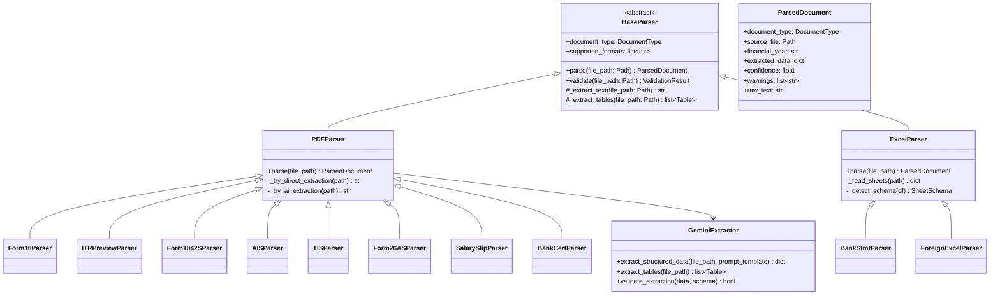
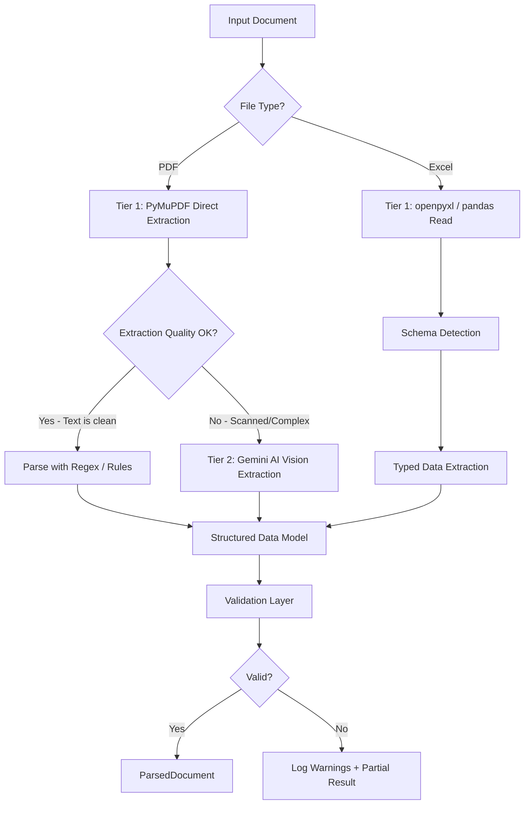
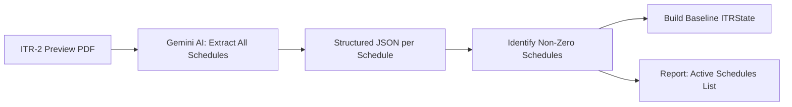
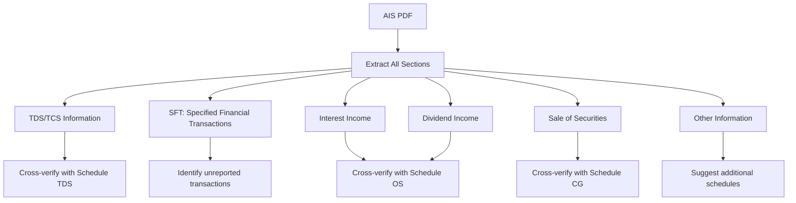
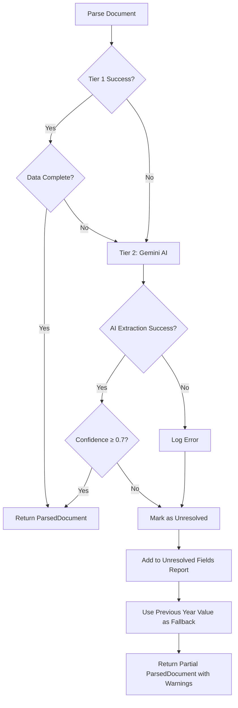

# Document Parsers Architecture — Indian Income Tax Calculator

> ⚠️ **DISCLAIMER**: This tool generates AI-assisted tax calculations and is prone to errors.
> All calculations, values, and details MUST be independently verified by the user before filing.

---

## 1. Parser Architecture



---

## 2. Parsing Strategy

Each parser follows a **two-tier extraction strategy**:



### Why Two Tiers?

| Tier | Method | When Used | Cost |
|------|--------|-----------|------|
| **Tier 1** | PyMuPDF / openpyxl direct extraction | Clean, text-based PDFs and Excel files | Free (local) |
| **Tier 2** | Gemini AI Vision API | Scanned PDFs, complex layouts, or when Tier 1 fails | API cost |

The system always tries Tier 1 first to minimize API calls and costs.

---

## 3. Parser Specifications

### 3.1 Previous Year ITR-2 Preview Parser (`itr_preview_parser.py`)

**Purpose**: Bootstrap all schedule data from last year's ITR-2 preview PDF.



**Extraction targets**:
- Every schedule's line items and totals
- PAN, Name, AY from the header
- Carried forward losses (for BFLA/CFL)
- Foreign asset details (for FA continuity)

**Gemini Prompt Strategy**: Send the full PDF to Gemini with a structured extraction prompt requesting JSON output per schedule. Validate against Pydantic models.

---

### 3.2 Form 16 Parser (`form16_parser.py`)

**Purpose**: Extract salary income details for Schedule Salary.

| Extraction Target | Location in Form 16 |
|--------------------|---------------------|
| Employer TAN, Name | Part A header |
| Salary u/s 17(1) | Part B - Table of Income |
| Perquisites u/s 17(2) | Part B |
| Profits u/s 17(3) | Part B |
| HRA Exemption u/s 10(13A) | Part B - Allowances |
| Standard Deduction u/s 16 | Part B |
| TDS Deducted | Part A - Quarter-wise TDS |
| Net Tax Payable | Part B |

**Validation**:
- Verify Financial Year matches configured FY
- Cross-check TDS with Form 26AS
- Verify Gross Salary = 17(1) + 17(2) + 17(3)

---

### 3.3 Form 1042-S Parser (`form_1042s_parser.py`)

**Purpose**: Extract US tax withholding data for Schedule FSI, TR, and Form 67.

| Field | Usage |
|-------|-------|
| Recipient's name, TIN | Taxpayer identification |
| Gross Income (Box 2) | Foreign income amount (USD) |
| Tax Rate (Box 3b) | Withholding rate |
| Federal Tax Withheld (Box 7a) | Foreign tax credit basis |
| Income Code | Classify into Dividend/Interest/CG |
| Country Code | For Schedule FSI country mapping |

**Currency Conversion**: Every USD amount is converted to INR using SBI TTBR rate for the date of credit/receipt.

---

### 3.4 AIS Parser (`ais_parser.py`)

**Purpose**: Extract and cross-verify all income reported by third parties.



**Key Checks**:
1. All AIS entries are accounted for in computed schedules
2. Flag any AIS entry not covered by provided documents
3. Suggest sections that need to be filed based on AIS data

---

### 3.5 Form 26AS Parser (`form26as_parser.py`)

**Purpose**: Verify TDS deducted by all deductors.

| Part | Content | Cross-Check Against |
|------|---------|-------------------|
| Part A | TDS on Salary | Form 16, Schedule TDS |
| Part A1 | TDS on Non-Salary | Bank certificates, Schedule TDS |
| Part A2 | TDS u/s 194IA/194IB/194M | Property transactions |
| Part B | TCS | Applicable purchases |
| Part C | Advance/Self-Assessment Tax | Tax challans |
| Part F | SFT | AIS data |

---

### 3.6 Bank Interest Certificate Parser (`bank_cert_parser.py`)

**Purpose**: Extract interest income for Schedule OS.

| Extraction | Details |
|------------|---------|
| Bank Name | Identifier |
| Account Type | Savings / FD / RD |
| Interest Amount | For Schedule OS |
| TDS Deducted | For Schedule TDS |
| Period | Verify it covers the full FY |

---

### 3.7 Bank Statement Parser - SGB (`bank_stmt_parser.py`)

**Purpose**: Extract Sovereign Gold Bond interest from bank statements.

| Input | Format |
|-------|--------|
| Bank Statement | Excel (.xlsx) |

**Logic**:
1. Read Excel file with transaction data
2. Filter transactions matching SGB interest credit patterns
3. Sum interest received during the FY
4. Map to Schedule OS (Interest from SGB)

---

### 3.8 Fidelity Documents Parser (`fidelity_parser.py`)

**Purpose**: Parse Fidelity brokerage documents for self-calculation of foreign income.

| Document | Data Extracted |
|----------|---------------|
| Monthly Statements | Holdings, dividends received, interest |
| Trade Reports | Buy/sell transactions with dates and amounts |
| Transaction Summary | Comprehensive transaction listing |

**Processing**:
1. Extract all dividend receipts → Schedule OS (quarter-wise)
2. Extract all trade transactions → Classify STCG/LTCG based on holding period
3. Extract interest income → Schedule OS
4. For each amount, fetch corresponding SBI TTBR rate
5. Generate complete capital gains computation (purchase price INR vs sale price INR)

---

### 3.9 Foreign Income Pre-Calculated Excel Parser (`foreign_excel_parser.py`)

**Purpose**: Read pre-computed foreign income data when user chooses Option 2.

**Expected Sheet Structure**:

| Sheet Name | Columns |
|------------|---------|
| `LTCG` | Asset Name, Buy Date, Buy Price (INR), Sell Date, Sell Price (INR), Gain/Loss, TTBR Rate Used |
| `STCG` | Same as LTCG |
| `Dividends` | Date, Amount (USD), Amount (INR), TTBR Rate, Quarter |
| `Interest` | Date, Amount (USD), Amount (INR), TTBR Rate |
| `F&O` | Trade details, P&L (INR) |
| `Schedule_FA` | Asset Type, Details, Peak Balance |
| `Schedule_FSI` | Country, Income Type, Amount (Foreign), Amount (INR), Tax Paid |
| `Form_67` | Country, Income, Tax Paid, DTAA Article |
| `Schedule_TR` | Country, Tax Paid, Relief Claimed |

---

### 3.10 Salary Slip Parser (`salary_slip_parser.py`)

**Purpose**: Extract March salary breakup to verify Form 16 data.

**Key Fields**: Basic Salary, HRA, Special Allowance, Deductions (PF, PT), Net Pay.

---

## 4. Document Type Enum

```python
class DocumentType(Enum):
    ITR_PREVIEW = "itr_preview"
    FORM_16 = "form_16"
    SALARY_SLIP = "salary_slip"
    IT_WORKING_SHEET = "it_working_sheet"
    FORM_1042S = "form_1042s"
    FIDELITY_STATEMENT = "fidelity_statement"
    FIDELITY_TRADES = "fidelity_trades"
    FIDELITY_TRANSACTIONS = "fidelity_transactions"
    FOREIGN_INCOME_EXCEL = "foreign_income_excel"
    AIS = "ais"
    TIS = "tis"
    FORM_26AS = "form_26as"
    BANK_INTEREST_CERT = "bank_interest_cert"
    BANK_STATEMENT_SGB = "bank_statement_sgb"
    DONATION_RECEIPT = "donation_receipt"
```

---

## 5. Gemini AI Integration for Parsing

### 5.1 API Client Design

```python
class GeminiClient:
    """Centralized Gemini API client with rate limiting and retry."""
    
    def __init__(self, api_key: str, model: str = "gemini-2.5-flash"):
        # Initialize with rate limiter (e.g., 15 RPM for free tier)
        pass
    
    def extract_from_pdf(
        self, 
        file_path: Path, 
        prompt_template: str,
        response_schema: type[BaseModel]
    ) -> dict:
        """Send PDF to Gemini Vision, get structured extraction."""
        pass
    
    def search_web(self, query: str) -> str:
        """Use Gemini's grounding/search for ITR regulatory changes."""
        pass
```

### 5.2 Prompt Template Strategy

Prompts are stored as text files in `ai/prompts/` for:
- Easy iteration without code changes
- Version control of prompt engineering
- Separate concerns between extraction logic and prompt design

**Example prompt template** (`extract_form16.txt`):
```
You are an expert Indian tax document parser. Extract the following fields 
from this Form 16 PDF and return them as a JSON object.

Financial Year: {financial_year}

Required fields:
1. employer_name: string
2. employer_tan: string
3. salary_17_1: number (Salary as per section 17(1))
4. perquisites_17_2: number (Value of perquisites as per section 17(2))
...

Return ONLY valid JSON. If a field is not found, set it to null.
Do NOT estimate or calculate values — extract only what is explicitly stated.
```

### 5.3 Confidence Scoring

Each AI extraction returns a confidence score:

| Score | Meaning | Action |
|-------|---------|--------|
| 0.9 - 1.0 | High confidence | Auto-accept |
| 0.7 - 0.9 | Medium confidence | Accept with warning in report |
| < 0.7 | Low confidence | Flag for manual review |

---

## 6. Error Handling & Fallback Strategy



**Key Principle**: Never silently fail. Every parsing issue is:
1. Logged with full context
2. Added to the unresolved fields report
3. Flagged in the final output reports

---

*Next: See [06_report_generation.md](./06_report_generation.md) for output format specifications.*
