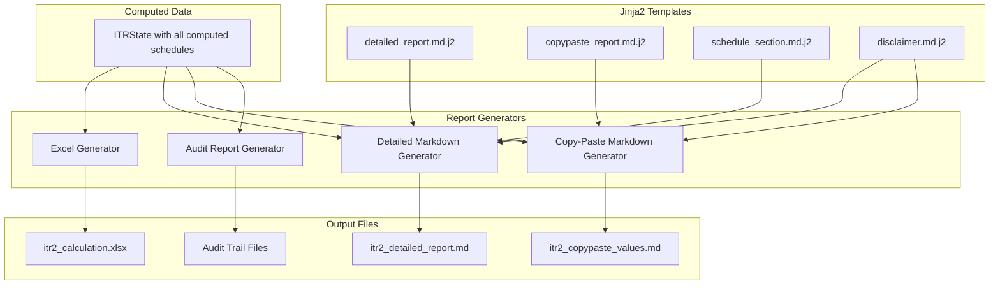
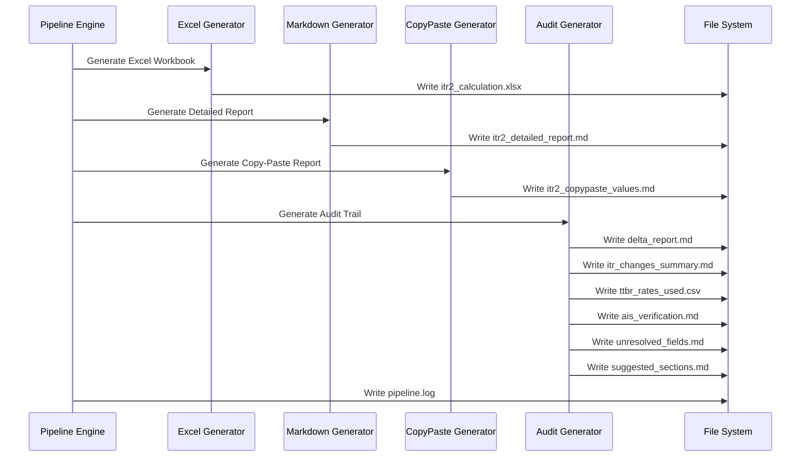

# Report Generation — Indian Income Tax Calculator

> ⚠️ **DISCLAIMER**: This tool generates AI-assisted tax calculations and is prone to errors.
> All calculations, values, and details MUST be independently verified by the user before filing.

---

## 1. Report Generation Architecture



---

## 2. Excel Workbook Specification

### 2.1 Workbook Structure

The Excel workbook contains multiple sheets, one per schedule plus summary sheets:

| Sheet Name | Content |
|------------|---------|
| **Summary** | High-level overview: Total Income, Tax Liability, Refund/Payable |
| **Salary** | Schedule Salary computation with Form 16 mapping |
| **House Property** | Schedule HP computation |
| **Capital Gains** | Schedule CG with per-transaction details |
| **Other Sources** | Schedule OS with quarter-wise dividend breakup |
| **Loss Set-Off** | CYLA + BFLA + CFL combined view |
| **Deductions** | Schedule VI-A + 80G + 80GGA |
| **Foreign Income** | Schedule FA + FSI + TR + Form 67 combined |
| **Special Income** | Schedule SI |
| **Exempt Income** | Schedule EI |
| **AMT** | Schedule AMT + AMTC |
| **TDS** | Schedule TDS reconciliation |
| **Part B-TI** | Total Income computation |
| **Part B-TTI** | Tax Liability computation |
| **TTBR Rates** | All SBI TTBR rates used with dates |
| **Verification** | AIS / 26AS cross-verification results |
| **Audit Trail** | Delta from previous year, unresolved fields |

### 2.2 Sheet Design Principles

Each schedule sheet follows a consistent layout:

```
┌─────────────────────────────────────────────────────┐
│ Row 1: Schedule Title + Section Reference            │
│ Row 2: AI Disclaimer Warning                         │
│ Row 3: (blank)                                       │
│ Row 4-N: Line items with:                           │
│   Column A: ITR Field Name                           │
│   Column B: ITR Field Code                           │
│   Column C: Value (Current Year)                     │
│   Column D: Value (Previous Year)                    │
│   Column E: Source Document                          │
│   Column F: Formula / Computation Notes              │
│   Column G: Confidence (High/Medium/Low)             │
│ Row N+1: (blank)                                     │
│ Row N+2: Section Total                               │
└─────────────────────────────────────────────────────┘
```

### 2.3 Formatting

- **Header row**: Bold, colored background (dark blue with white text)
- **Currency cells**: Indian Rupee format (`₹ #,##,###`)
- **Formula cells**: Light yellow background to indicate computed values
- **Warning cells**: Light red background for low-confidence or unresolved values
- **Previous year comparison**: Gray italic text for easy visual distinction
- **Conditional formatting**: Highlight mismatches between current and previous year

### 2.4 Excel Generation Library

Using `openpyxl` for:
- Full control over formatting, formulas, and cell styles
- Named ranges for cross-sheet references
- Data validation dropdowns where user input may be needed
- Print-ready page setup with headers/footers

---

## 3. Detailed Markdown Report Specification

### 3.1 Report Structure

```markdown
# ITR-2 Income Tax Calculation Report
## Financial Year: 2025-26 | Assessment Year: 2026-27

> ⚠️ **WARNING**: This report is AI-generated and may contain errors. 
> Please verify ALL calculations and values before filing your tax return.
> The tool developers and AI assume no liability for incorrect data.

---

## Table of Contents
1. [Executive Summary](#executive-summary)
2. [Schedule Salary](#schedule-salary)
3. [Schedule HP](#schedule-hp)
...
20. [Part B-TTI](#part-b-tti)
21. [Cross-Verification Report](#cross-verification)
22. [Unresolved Items](#unresolved-items)
23. [ITR Changes Summary](#itr-changes)
24. [Appendix: TTBR Rates Used](#ttbr-rates)

---

## Executive Summary

| Metric | Amount |
|--------|--------|
| Gross Total Income | ₹ XX,XX,XXX |
| Total Deductions | ₹ X,XX,XXX |
| Total Income | ₹ XX,XX,XXX |
| Tax Before Relief | ₹ X,XX,XXX |
| Tax Relief (Foreign) | ₹ XX,XXX |
| Net Tax Liability | ₹ X,XX,XXX |
| TDS Already Deducted | ₹ X,XX,XXX |
| **Tax Payable / (Refund)** | **₹ XX,XXX / (₹ XX,XXX)** |

---

## Schedule Salary
### Source Documents: Form 16, March Salary Slip

| # | Field | ITR Code | Amount | Source |
|---|-------|----------|--------|--------|
| 1 | Salary u/s 17(1) | 1a | ₹ XX,XX,XXX | Form 16 |
| 2 | Perquisites u/s 17(2) | 1b | ₹ X,XX,XXX | Form 16 |
...

### Computation Notes
- Standard deduction of ₹75,000 applied under New Regime (Section 16(ia))
- HRA exemption not applicable under New Tax Regime

---
(... continues for each schedule ...)
```

### 3.2 Per-Schedule Section Template

Each schedule section includes:
1. **Schedule title** with ITR section reference
2. **Source documents** used for this schedule
3. **Data table** with field name, ITR code, computed value, and source
4. **Computation notes** explaining formulas and special rules applied
5. **Previous year comparison** (delta from last year)
6. **Warnings** for low-confidence or unresolved values

### 3.3 Special Sections

| Section | Content |
|---------|---------|
| **Cross-Verification** | Comparison of computed values vs AIS/TIS/26AS with match/mismatch status |
| **Unresolved Items** | List of values that could not be auto-populated and used previous year data |
| **ITR Changes Summary** | Regulatory changes discovered via web search, with impact assessment |
| **TTBR Rates Appendix** | Table of all SBI TTBR rates used with transaction date and conversion details |
| **Suggested Sections** | Additional sections recommended based on document analysis |

---

## 4. Copy-Paste Values Markdown Specification

### 4.1 Purpose

A streamlined document optimized for **direct data entry** into the Income Tax portal. No explanations, no formulas — just field names and values organized by ITR-2 schedule.

### 4.2 Format

```markdown
# ITR-2 Values — Copy Paste Reference
## FY 2025-26 | AY 2026-27

> ⚠️ AI-generated. Verify all values before entering.

---

## SCHEDULE SALARY

| Field | Value |
|-------|-------|
| Salary as per section 17(1) | XX,XX,XXX |
| Value of perquisites as per section 17(2) | X,XX,XXX |
| Profits in lieu of salary as per section 17(3) | 0 |
| Gross Salary (1a + 1b + 1c) | XX,XX,XXX |
| Exemption u/s 10 - HRA | 0 |
| Standard Deduction u/s 16(ia) | 75,000 |
| Income chargeable under the head Salaries | XX,XX,XXX |

---

## SCHEDULE HP

| Field | Value |
|-------|-------|
| Gross Annual Value | X,XX,XXX |
| ...

---

## SCHEDULE CG

### LTCG

| Field | Value |
|-------|-------|
| Full value of consideration | XX,XX,XXX |
| Cost of acquisition | XX,XX,XXX |
| Long term capital gain | X,XX,XXX |
| Deduction u/s 112A (exempt up to 1,25,000) | 1,25,000 |
| Taxable LTCG | X,XX,XXX |

### STCG
...

---

(continues for every schedule with non-zero values)
```

### 4.3 Design Choices

- **No ₹ symbol**: Raw numbers for easy copy-paste into form fields
- **Comma-separated**: Indian numbering system (XX,XX,XXX)
- **Zero values included**: So user knows they were intentionally computed as zero
- **Only non-zero schedules**: Skip entirely empty schedules to reduce noise
- **Section headers match ITR-2 form**: Exact field labels matching the income tax portal

---

## 5. Form 67 Report

Generated only when Schedule FSI is applicable:

```markdown
# Form 67 — Statement of Income from a Country Outside India

> ⚠️ AI-generated. Verify all values.

## Part A: Details of Income from Country Outside India

| # | Country | TIN | Nature of Income | Income (Foreign Currency) | Income (INR) | Tax Paid (Foreign) | Tax Paid (INR) | DTAA Article |
|---|---------|-----|-----------------|--------------------------|-------------|-------------------|----------------|-------------|
| 1 | US | XXX | Dividend | $X,XXX | ₹X,XX,XXX | $XXX | ₹XX,XXX | Art 10 |
| 2 | US | XXX | Interest | $XXX | ₹XX,XXX | $XX | ₹X,XXX | Art 11 |
| 3 | US | XXX | Capital Gains | $X,XXX | ₹X,XX,XXX | $0 | ₹0 | Art 13 |

## Part B: Summary

| Total Income from Outside India (INR) | ₹X,XX,XXX |
| Total Tax Paid Outside India (INR) | ₹XX,XXX |
| Tax Relief Claimed u/s 90/90A/91 | ₹XX,XXX |
```

---

## 6. Audit Trail Files

### 6.1 Delta Report (`audit/delta_report.md`)

```markdown
# Delta Report: Previous Year vs Current Year

## Fields Updated from Current Year Documents
| Schedule | Field | Previous Year | Current Year | Source |
|----------|-------|---------------|-------------|--------|
| Salary | Salary u/s 17(1) | ₹18,50,000 | ₹22,00,000 | Form 16 |
...

## Fields Retained from Previous Year (No Current Document Found)
| Schedule | Field | Value Used | Reason |
|----------|-------|-----------|--------|
| FA | Peak Balance - Fidelity | $45,000 | No current year statement provided |
...

## New Fields (Not in Previous Year)
| Schedule | Field | Value | Source |
|----------|-------|-------|--------|
| OS | SGB Interest | ₹12,500 | Bank Statement |
...
```

### 6.2 ITR Changes Summary (`audit/itr_changes_summary.md`)

Generated via Gemini web search:

```markdown
# ITR Changes for FY 2025-26

> Source: Web search via Gemini AI on [date]. Verify from official sources.

## Tax Rate Changes
- LTCG tax rate changed from 10% to 12.5% (Section 112A)
- STCG on equity: changed from 15% to 20% (Section 111A)
- LTCG exemption limit changed from ₹1,00,000 to ₹1,25,000

## New Regime Changes
- Standard deduction increased to ₹75,000
- New tax slabs: [details]

## Schedule-Specific Changes
- Schedule FA: [any changes to reporting requirements]
- Schedule AL: Threshold remains at ₹1 crore total income
...
```

---

## 7. Warning/Disclaimer Implementation

Every output file includes the disclaimer. It is rendered from a shared Jinja2 template:

**`templates/disclaimer.md.j2`**:
```
> ⚠️ **WARNING — AI-GENERATED DOCUMENT**
> 
> This {{ document_type }} was generated by an AI-powered tax calculation tool 
> on {{ generation_date }}.
> 
> **This document is prone to errors.** Please verify ALL calculations, values, 
> and section details independently before filing your income tax return.
> 
> The developers and AI models assume NO LIABILITY for:
> - Incorrect calculations or tax computations
> - Missing or misclassified income
> - Incorrect currency conversions
> - Outdated tax rates or regulatory information
> - Any penalties, interest, or legal consequences arising from use of this tool
> 
> Always consult a qualified Chartered Accountant for professional tax advice.
```

---

## 8. Report Generation Sequence



---

*Next: See [07_security_design.md](./07_security_design.md) for security architecture details.*
