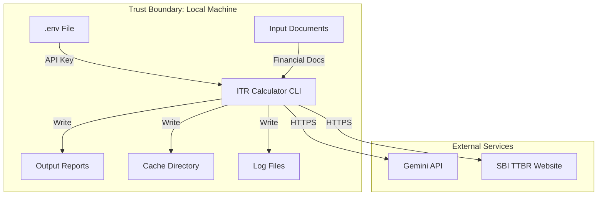

# Security Design — Indian Income Tax Calculator

> ⚠️ **DISCLAIMER**: This tool generates AI-assisted tax calculations and is prone to errors.
> All calculations, values, and details MUST be independently verified by the user before filing.

---

## 1. Security Overview

This application handles highly sensitive Personally Identifiable Information (PII) and financial data. While it runs as a local CLI tool (no web server, no database), security is critical for:

- API key management (Gemini)
- PII handling (PAN, Aadhaar, bank details, income figures)
- File system security (input documents, output reports)
- Network security (API calls, web scraping)
- Logging hygiene (no secrets or PII in logs)

---

## 2. Threat Model



### 2.1 Assets to Protect

| Asset | Sensitivity | Location |
|-------|------------|----------|
| Gemini API Key | **Critical** | `.env` file |
| PAN Number | **High** | Input docs, output reports |
| Aadhaar Number | **High** | Input docs (if present) |
| Bank Account Numbers | **High** | Input docs, interest certificates |
| Income Figures | **High** | Input docs, computed data, reports |
| Foreign Account Details | **High** | 1042-S, trade reports, Schedule FA |
| TDS/Tax Payment Details | **Medium** | Form 26AS, Form 16 |

### 2.2 Threat Vectors

| Threat | Risk | Mitigation |
|--------|------|-----------|
| API key leak via VCS | High | `.gitignore`, no hardcoded fallbacks, error on missing key |
| PII in logs | High | PII masking utility applied to all log output |
| PII in terminal output | Medium | Masking in Rich display; full values only in files |
| Malicious input files | Medium | File type validation, sandboxed parsing |
| Man-in-the-middle on API calls | Medium | HTTPS enforcement, certificate validation |
| Output files accessed by others | Medium | User warned; recommend restrictive file permissions |
| Path traversal in file operations | Low | All paths resolved and bounded to input/output dirs |
| Prompt injection via document content | Low | Structured prompts with clear instructions to Gemini |

---

## 3. API Key Management

### 3.1 Key Storage

```python
# settings.py — Pydantic settings model
from pydantic_settings import BaseSettings

class Settings(BaseSettings):
    gemini_api_key: str  # REQUIRED — no default, no fallback
    
    model_config = SettingsConfigDict(
        env_file=".env",
        env_file_encoding="utf-8",
    )

def get_settings() -> Settings:
    """Load settings. Raises ValidationError if GEMINI_API_KEY is missing."""
    try:
        return Settings()
    except ValidationError as e:
        # TODO(security): Consider KMS integration for production deployment
        raise SystemExit(
            "ERROR: GEMINI_API_KEY not found in .env file.\n"
            "Please create a .env file with: GEMINI_API_KEY=your-key-here"
        ) from e
```

### 3.2 Key Security Rules

| Rule | Implementation |
|------|---------------|
| No hardcoded API keys | Pydantic `Settings` with no default value |
| No fallback secrets | Application exits if key is missing |
| `.env` in `.gitignore` | Pre-configured in project `.gitignore` |
| Key not logged | Logger never receives the key value |
| Key not in output | Reports never contain the API key |
| `.env.example` provided | Template file for user setup |

---

## 4. PII Masking

### 4.1 Masking Utility

```python
# utils/masking.py
import re

def mask_pan(pan: str) -> str:
    """Mask PAN: ABCDE1234F → XXXXX1234X"""
    if len(pan) == 10:
        return f"XXXXX{pan[5:9]}X"
    return "XXXXXXXXXX"

def mask_aadhaar(aadhaar: str) -> str:
    """Mask Aadhaar: 1234 5678 9012 → XXXX XXXX 9012"""
    digits = re.sub(r'\D', '', aadhaar)
    if len(digits) == 12:
        return f"XXXX XXXX {digits[8:]}"
    return "XXXX XXXX XXXX"

def mask_bank_account(account: str) -> str:
    """Mask bank account: Show only last 4 digits"""
    if len(account) >= 4:
        return f"{'X' * (len(account) - 4)}{account[-4:]}"
    return "XXXX"

def mask_for_logging(text: str) -> str:
    """Apply all masking patterns to a text string for safe logging."""
    # PAN pattern: 5 letters + 4 digits + 1 letter
    text = re.sub(r'[A-Z]{5}\d{4}[A-Z]', lambda m: mask_pan(m.group()), text)
    # Aadhaar pattern: 12 digits (with optional spaces)
    text = re.sub(r'\d{4}\s?\d{4}\s?\d{4}', lambda m: mask_aadhaar(m.group()), text)
    return text
```

### 4.2 Where Masking is Applied

| Context | Masking Level |
|---------|--------------|
| Log files (`pipeline.log`) | Full PII masking (PAN, Aadhaar, bank accounts) |
| Terminal display (Rich) | PAN masked; amounts shown in summary only |
| AI interaction logs | PII masking on logged prompts/responses |
| Output reports (Excel, MD) | **No masking** — user needs full values for filing |
| Error messages | No PII — generic error descriptions only |

---

## 5. File System Security

### 5.1 Path Validation

```python
# utils/validators.py
from pathlib import Path

def validate_path_within_boundary(file_path: Path, boundary: Path) -> Path:
    """Ensure resolved path is within the allowed directory boundary."""
    resolved = file_path.resolve()
    boundary_resolved = boundary.resolve()
    
    # Strict boundary check with trailing separator to prevent partial matches
    if not str(resolved).startswith(str(boundary_resolved) + "/"):
        if resolved != boundary_resolved:
            raise SecurityError(
                f"Path '{resolved}' is outside allowed boundary '{boundary_resolved}'"
            )
    return resolved
```

### 5.2 File Operations Rules

| Rule | Implementation |
|------|---------------|
| Input files only read from `INPUT_DIR` | Path validation before every read |
| Output files only written to `OUTPUT_DIR` | Path validation before every write |
| No symlink following | `Path.resolve()` before boundary check |
| File type validation | Check magic bytes for PDF; validate Excel structure |
| Size limits | Reject files > 100MB (configurable) |

### 5.3 XML Hardening

Since we process Excel (`.xlsx`) files which are ZIP archives containing XML:

```python
# parsers/excel_parser.py
import defusedxml.ElementTree as ET  # Use defusedxml, not stdlib xml

# When using openpyxl, it handles XML safely by default,
# but we add explicit checks:
# TODO(security): Validate that openpyxl version used has no known XML vulnerabilities
```

---

## 6. Network Security

### 6.1 HTTPS Enforcement

```python
# external/ttbr.py
import requests

ALLOWED_URLS = [
    "https://www.sbi.co.in",  # SBI TTBR rates
]

def fetch_ttbr_rates(date: str) -> dict:
    """Fetch SBI TTBR rates. HTTPS only."""
    url = f"https://www.sbi.co.in/..."  # Exact URL for TTBR
    
    # Verify SSL certificate
    response = requests.get(
        url,
        timeout=30,
        verify=True,  # SSL certificate verification
    )
    response.raise_for_status()
    return parse_ttbr_response(response)
```

### 6.2 Gemini API Security

| Concern | Mitigation |
|---------|-----------|
| Data sent to Gemini | Only document content needed for extraction; no credentials |
| API key transmission | Via secure HTTP header; HTTPS enforced by Google client library |
| Response validation | All AI responses validated against Pydantic schemas |
| Rate limiting | Client-side rate limiter prevents accidental overuse |
| Prompt injection | Structured prompts with explicit output format instructions |

---

## 7. Logging Security

### 7.1 Logging Configuration

```python
# config/settings.py
import logging

def setup_logging(log_level: str, log_file: Path):
    """Configure logging with PII-safe formatting."""
    
    class PIISafeFormatter(logging.Formatter):
        def format(self, record):
            # Apply PII masking to all log messages
            record.msg = mask_for_logging(str(record.msg))
            if record.args:
                record.args = tuple(
                    mask_for_logging(str(a)) if isinstance(a, str) else a
                    for a in record.args
                )
            return super().format(record)
    
    formatter = PIISafeFormatter(
        '%(asctime)s - %(name)s - %(levelname)s - %(message)s'
    )
    
    # File handler for pipeline.log
    file_handler = logging.FileHandler(log_file)
    file_handler.setFormatter(formatter)
    
    # Console handler (more restrictive)
    console_handler = logging.StreamHandler()
    console_handler.setFormatter(formatter)
    
    logging.basicConfig(
        level=getattr(logging, log_level.upper()),
        handlers=[file_handler, console_handler]
    )
```

### 7.2 What is NOT Logged

| Data | Reason |
|------|--------|
| `GEMINI_API_KEY` | Critical secret |
| Full PAN numbers | PII — masked to `XXXXX1234X` |
| Aadhaar numbers | PII — masked to `XXXX XXXX 9012` |
| Bank account numbers | PII — masked to `XXXXX1234` |
| Full income amounts | Logged as categories, not values |
| Raw AI responses | Logged to separate `ai_interactions.log` with masking |

---

## 8. Secure Data Handling

### 8.1 In-Memory Data

- Pydantic models enforce type safety and validation
- `Decimal` type for all monetary values (prevents floating-point errors)
- No global mutable state — all data flows through the pipeline state object
- Sensitive fields use `SecretStr` where appropriate

### 8.2 Output File Security

```python
# reports/base.py
import os

def write_output_file(path: Path, content: bytes | str):
    """Write output file with restrictive permissions."""
    # Validate path is within output boundary
    validate_path_within_boundary(path, settings.output_dir)
    
    # Write with restrictive permissions (owner read/write only)
    path.parent.mkdir(parents=True, exist_ok=True)
    
    if isinstance(content, str):
        path.write_text(content, encoding='utf-8')
    else:
        path.write_bytes(content)
    
    # Set file permissions: owner read/write only
    os.chmod(path, 0o600)
```

---

## 9. Security Verification Plan

| # | Check | Method |
|---|-------|--------|
| 1 | API key not hardcoded | Static analysis + code review |
| 2 | `.env` in `.gitignore` | Automated check in CI |
| 3 | PII masking in logs | Unit tests with PII patterns |
| 4 | Path traversal prevention | Unit tests with `../` and symlinks |
| 5 | HTTPS enforcement | Integration test for external calls |
| 6 | File type validation | Unit tests with malformed files |
| 7 | XML hardening | Verify defusedxml usage |
| 8 | No PII in error messages | Code review of all exception handlers |
| 9 | Output file permissions | Integration test verifying `0o600` |
| 10 | Rate limiting on Gemini API | Unit test for rate limiter |

---

## 10. Security TODO Items

```
# TODO(security): Consider encrypting output reports at rest
# TODO(security): Add option to securely delete intermediate files after report generation
# TODO(security): Implement audit logging for all file access operations
# TODO(security): Consider adding checksum verification for downloaded TTBR data
# TODO(security): Evaluate prompt injection risks with adversarial document content
# TODO(security): Add file size limits to prevent DoS via large input files
```

---

*This completes the high-level design documentation. See the [Architecture Overview](./01_architecture_overview.md) for the document index.*
